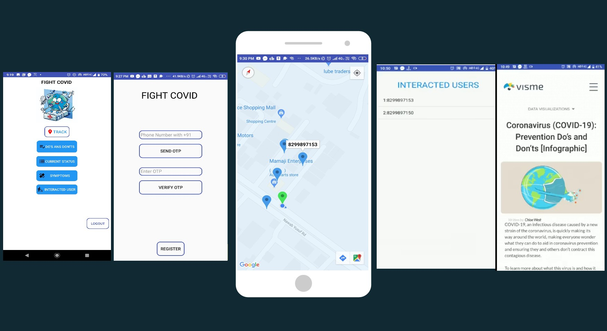

# Fight-with-covid
We have developed a mobile application that helps in tracking the INFECTION OF COVID( CHAIN BREAKING )that can be installed by everyone to fight with a worldwide pandemic like COVID-19. 

# It will help the society in several ways:- 
1. Our application will provide the most exclusively updated data and will also provide meaningful statistics to aware the people about the seriousness of the situation in their area.
 2. It will also provide a vibration alert(with the help of GPS which would be always ON for our app) for whenever two persons having our app will come closer than 1.5 meters, which is necessary in order to maintain the social distancing to combat with this pandemic right now.
 3:Now if any user proves to be infected (positive COVID-19),then the list all the people he/she interacted with can be taken from the app and hence the CHAIN of FURTHER Infection can be stopped. 
4:After this all the region he/she(positive COVID) travelled during the period of infection (past 10 days) will be RED marked on google MAP and hence those area would be dangerous for travelling for other.These areas should be sanitized.
 5. Our application will also provide a color marking to a different group of people in our map interface to recognize who is infected and who is not so that to provide an alert to the healthy user if he/she is going nearby any infected user or vice-versa. 
6. Last but not the least, this app will also help police administration to track down the area where there are still many people coming out from their home and making unnecessary crowd.
